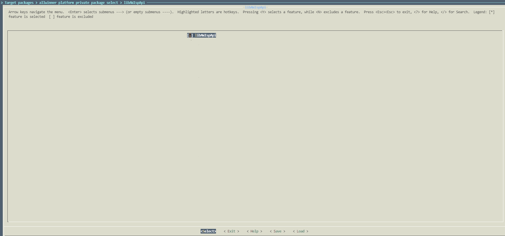
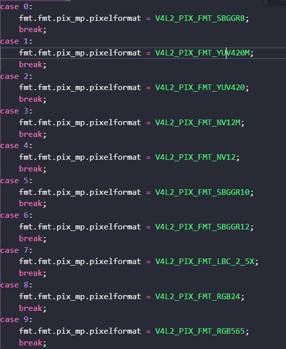

# ISPdemo注意事项：
1、确保vin驱动正确加载；

# ISPdemo运行步骤：
1、打开编译libAWIspApi软件选项，重新编译、打包固件并烧录至设备端；

buildroot方案libAWIspApi编译开关配置如下所示：

```
~/workspace/t527_linux_aiot$ ./build.sh buildroot_menuconfig
```


2、确认设备端usr/lib目录下存在libisp.so、libisp_ini.so、libAWIspApi.so；

3、将AWISPdemo推送至设备端，ISPdemo生成路径如下所示:

```
workspace\t527_linux_aiot\out\t527\demo_linux_aiot\buildroot\buildroot\build\libAWIspApi\ispxxx\demo
```

4、运行AWISPdemo，命令如下所示

```
./AWISPdemo 0 0 640 480 ./ 1 20 30 0 0

@arg1:  video节点号
@arg2:  rear/front(默认:0)
@arg3:  out_width
@arg4:  out_height
@arg5:  数据保存路径
@arg6:  数据格式(数据格式如下图所示)
@arg7:  数据保存帧数
@arg8:  帧率
@arg9:  WDR模式(0:normal  1:wdr)
@arg10: 拼接模式开关(0:close  1:open)
```




